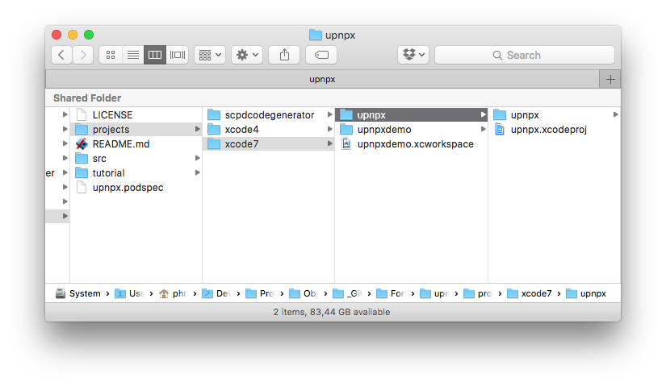
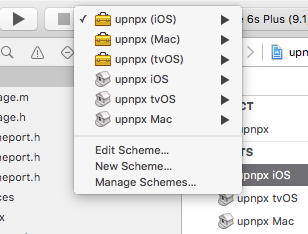
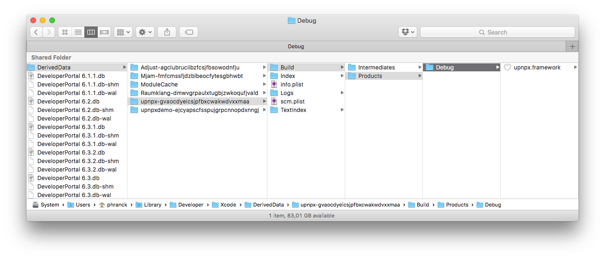

[Home](../)

# upnpx Tutorial
## Building static libupnpx.a library

Before using the library you have to build the **upnpx** static library `libupnpx.a`. 
 

1. Open the desired project with Xcode. We use the one from the [upnpx for Xcode 7](../../projects/xcode7/upnpx/upnpx.xcodeproj) project.

2. Select the required scheme (target). There are several schemes (for OSX, iOS and tvOS) available. You can build either static libraries or frameworks depending on your needs.

3. Build it. The result is the **upnpx** static library or framework for the platform you selected (the location of the build product depends on the chosen project and scheme).

[Home](../)
