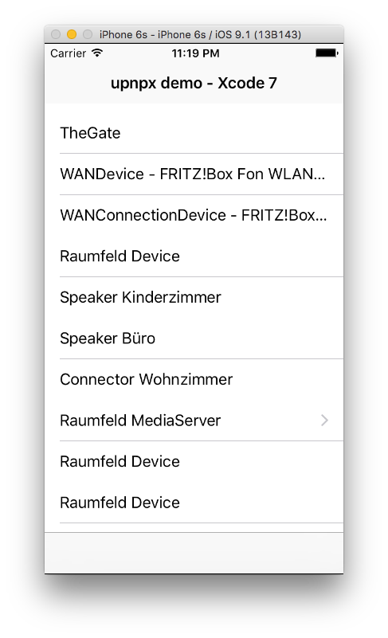

[Addressing](addressing.md) ← [Home](../) → [Description](description.md)

# upnpx Tutorial
## 2. Discovery

> UPnP specifications: _"Through discovery, control points find interesting device(s)"_.


During Discovery we will search for any UPnP device on the local network. upnpx implements the **SSDP protocol** (*Simple Service Discovery Protocol*) and maintains an in-memory database of all devices on the network. It  will automatically update this database when new devices are added or removed.
Your code can read the database and get notifications when an update is done.

Check out the latest [Xcode 7 project](../../projects/xcode7) to see an example of a functional **SSDP** implementation:




## There are just 3 Steps to implement SSDP

### 1. Usage of the UPnPDBObserver protocol

Let your [`ViewController`](../../projects/xcode7/upnpxdemo/upnpxdemo/RootViewController.h) conform to the [`UPnPDBObserver`](../../src/api/UPnPDB.h#L46) protocol:

```Objective-C
#import "UPnPDB.h"

@interface RootViewController : UITableViewController <UPnPDBObserver> {
	NSArray *mDevices; 		//BasicUPnPDevice*
}

//protocol UPnPDBObserver
-(void)UPnPDBWillUpdate:(UPnPDB*)sender;
-(void)UPnPDBUpdated:(UPnPDB*)sender;
```


### 2. Register yourself as an observer to UPnPManager's discovery database and tell the SSDP implementation to search for devices by calling searchSSDP 

Extracted from the example's [RootViewController.m](../../projects/xcode7/upnpxdemo/upnpxdemo/RootViewController.m#L23-L39):

```Objective-C
- (void)viewDidLoad {
    [super viewDidLoad];
    
    UPnPDB* db = [[UPnPManager GetInstance] DB];
    mDevices = [db rootDevices]; //BasicUPnPDevice
    
    [db addObserver:self];
    
    //Optional; set User Agent
    [[[UPnPManager GetInstance] SSDP] setUserAgentProduct:@"upnpxdemo/1.0" andOS:@"OSX"];
    
    
    //Search for UPnP Devices 
    [[[UPnPManager GetInstance] SSDP] searchSSDP];      
    
    self.title = @"upnpx demo";
    ...
}
```


### 3. Implement the UPnPDBObserver callback functions: 

Extracted from the example's [RootViewController.m](../../projects/xcode7/upnpxdemo/upnpxdemo/RootViewController.m#L121-L130):

```Objective-C
#pragma mark - protocol UPnPDBObserver

-(void)UPnPDBWillUpdate:(UPnPDB*)sender{
    NSLog(@"UPnPDBWillUpdate %lu", (unsigned long)[mDevices count]);
}

-(void)UPnPDBUpdated:(UPnPDB*)sender{
    NSLog(@"UPnPDBUpdated %lu", (unsigned long)[mDevices count]);
    [menuView performSelectorOnMainThread : @ selector(reloadData) withObject:nil waitUntilDone:YES];
}
```

<br>

The above code is all what is needed to search for UPnP devices on the Local Network. The `NSArray *mDevices` contains a set of [`BasicUPnPDevice`](../../src/api/BasicUPnPDevice.h) objects. The **upnpx** stack will automatically keep track of any changes (device add, remove, update) and the `UPnPDBUpdated` functions will be called whenever such changes are discovered. 

There is little extra coding to be done in order to fill in an `UITableView` to display the found UPnP devices on the iPhone UI. 


[Addressing](addressing.md) ← [Home](../) → [Description](description.md)
